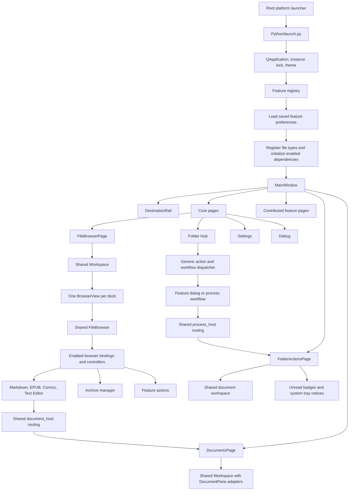
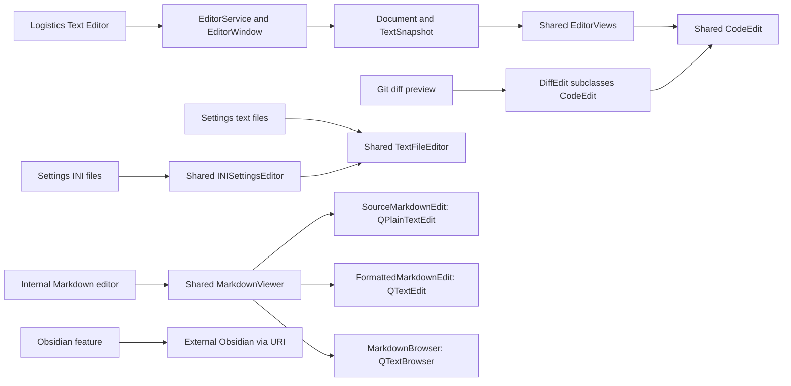
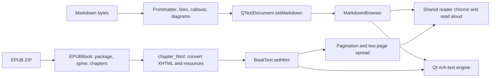
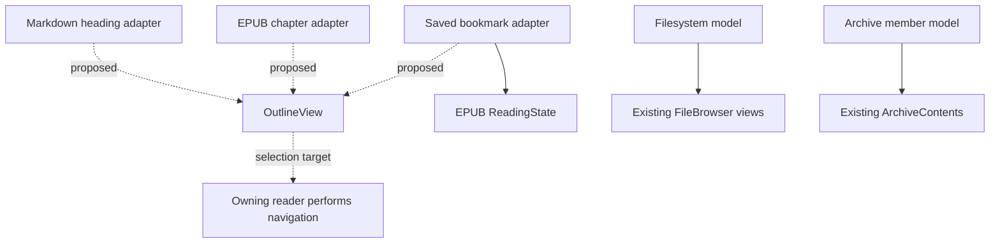
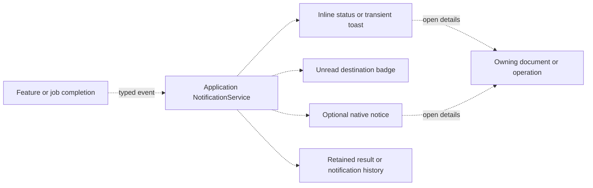

# Logistics architecture and reuse assessment

Source review dated October 10, 2026. This assessment maps the current checkout and proposes cleanup; it does not implement any refactoring.

The application already shares substantial infrastructure through **commonUtils**. The best next step is to make the boundaries between presentation, document state, application hosting, and domain behavior more explicit. Several similar-looking screens should share smaller components rather than become one enormous configurable window.

The main opportunities are document lifecycle, text persistence, outline navigation, notification delivery, and consistent worker ownership. Filesystem and archive browsing have genuine presentation overlap, but their data models and operations differ enough that full browser unification would be a larger architectural project.

## Reading the maps

- **Existing reuse** means the source imports or subclasses the same implementation.
- **Related implementations** means separate code solves a similar problem; this does not establish that either implementation is unnecessary.
- **Proposed reuse** means a possible extraction, not an existing API.
- Arrows in the maps show ownership, composition, or calls as labeled. They are not a complete import graph.

The feature inventory covers distributed Logistics packages. The detailed call paths focus on editors, readers, browsing, tabs, jobs, and notifications. External feature source reached through `Python/features/emulation` is outside this assessment. `commonUtils` is a separate Git submodule, so future changes there need their own validation and commit coordination. Root README coverage is unchanged.

## 1. Application map



Sources: [startup](Python/launch.py), [main shell](Python/ui_new/main_window.py), [registry](Python/features/registry.py), [document hosting](Python/ui_new/documents.py), [folder operation hosting](Python/ui_new/folder_actions.py).

Important distinctions:

1. **Folder Hub** is a list of logical local/remote folder entries and detected feature actions. It is not the filesystem explorer.
2. **FileBrowser** is the reusable filesystem explorer. Features add actions, previews, file types, and activation.
3. **DocumentsPage** hosts original reader/editor windows inside dockable panes. The original window still decides whether closing is allowed.
4. **FolderActionsPage** specializes that hosting for process results, unread completion state, and native notices.
5. **Settings** loads feature settings lazily and uses shared text/INI editors. Feature settings need not be navigation pages.
6. **ServersPage** exists as a generic contribution consumer, but it is not in the current `CORE_TABS` list. A folder tree should not be mistaken for the live navigation menu.

## 2. Folder tree with responsibilities

This is a responsibility map, not an exhaustive listing of every asset or private module.

```text
logistics/
├── LaunchLogistics_*                Platform launch and environment setup
├── launch_config.ini               Launcher configuration
├── README / USER_GUIDE / DEVELOPMENT / CONFIGURATION / RELEASING
├── Scripts/                        Standalone utilities
├── Software/                       External software resources
├── RemoteCredentials/              Credential resources, separate from UI logic
└── Python/
    ├── launch.py                   Application startup
    ├── config.py, configFile.ini   Core configuration
    ├── pyproject.toml, uv.lock     Runtime and developer dependency definitions
    ├── models/
    │   ├── logistics_folder.py     Domain folder built on shared Directory
    │   ├── local_folder.py         Local domain folder
    │   ├── remote_folder.py        Remote domain folder
    │   ├── folder_entry.py         Local/remote association and source context
    │   └── folder_discovery.py     Configured local-folder discovery
    ├── services/
    │   ├── application_instance.py Instance-lock policy
    │   ├── folder_sources.py       Provider snapshots and discovery
    │   ├── folder_entries.py       Match/filter logical folder entries
    │   ├── folder_safety.py        Protected-folder policy
    │   ├── software.py             Software selection and provisioning policy
    │   ├── password_prompt.py      GUI password confirmation
    │   └── zip_passwords.py        Configured/verified ZIP password handling
    ├── ui_new/                     Logistics shell and application adapters
    │   ├── main_window.py          Destinations, retained pages, application close
    │   ├── sidebar.py              Destination rail and document/action entries
    │   ├── file_browser.py         BrowserView and Workspace hosts; feature bindings
    │   ├── documents.py            Embed, detach, retain, and close reader/editor panes
    │   ├── folder_actions.py       Process panes, unread state, native notifications
    │   ├── actions.py              Execute contributed actions consistently
    │   ├── workflows.py            Resolve contributed workflow handlers
    │   ├── pages/                  Folders, Servers, Debug, Settings, Features
    │   ├── settings/               Shared INI editor adapters and index settings
    │   ├── dialogs/                Generic tool and archive-password dialog support
    │   └── bulk_rename/            Logistics rename UI over reusable rename engine
    ├── features/                   Domain behavior and feature-owned presentation
    │   ├── registry.py             Discovery, dependencies, toggles, contribution collection
    │   ├── contributions.py        Logistics contribution contracts
    │   ├── preferences.py          Persist disabled-feature choices
    │   ├── text_editor/            Editor service, document state, menus, IO, recovery
    │   ├── books/                  EPUB parser, conversion, pagination, bookmarks, metadata
    │   ├── comics/                 CBZ/CBR, metadata, library, image reader, cache, encryption
    │   ├── archives/               Archive workbench, sessions, prompts, result policy
    │   ├── git/                    Repository engine and Git workspace
    │   └── other feature packages  See inventory below
    ├── commonUtils/                Separate reusable library repository
    │   ├── features.py             Declarative file types and browser capabilities
    │   ├── filesystem.py           Generic browser details, panels, action descriptors
    │   ├── fileUtils / dirUtils / traversal / file_operations / renameUtils
    │   ├── fileTypes/              File classes and type registry
    │   ├── directory_index.py      Persistent/shared directory metadata facade
    │   ├── _directory_*.py         Store, scan, reconciliation, query, metadata internals
    │   ├── archives/               Models, formats, reading, extraction, creation, editing
    │   ├── zip_access.py           ZIP access and verification mechanics
    │   ├── text_files.py           TextSnapshot, decoding, conflict checks, atomic writes
    │   ├── session_store.py        Versioned editor checkpoint storage
    │   ├── configuration/          Typed INI schema
    │   ├── storage.py              Shared application data/cache locations
    │   ├── operations / streams / downloads / wrappers
    │   └── ui/
    │       ├── pyside/             Qt facade, application, windows, messages, widgets
    │       ├── theme.py, icons.py  Appearance and icon binding
    │       ├── workspace.py        Dock tabs, view ownership, detach/reattach, close
    │       ├── workspace_drag.py   Dock movement and cross-workspace drag mechanics
    │       ├── document_host.py    Optional application document routing
    │       ├── process_host.py     Optional application process-window routing
    │       ├── file_browser/       Filesystem browser, views, model, indexing, actions
    │       ├── archive_view/       Separate reusable archive-member list and preview UI
    │       ├── code_editor/        CodeEdit, gutter, split views, search, syntax, diff
    │       ├── text_editor.py      Small TextFileEditor for configuration files
    │       ├── ini_editor.py       INISettingsEditor extends TextFileEditor
    │       ├── markdown/          Preview, source/formatted editing, headings, links, IO
    │       ├── reader_chrome.py    Reader buttons, labels, fullscreen, spacing
    │       ├── reader_menus.py     Reader menu mechanics and recent files
    │       ├── read_aloud.py       Shared speech and text tracking
    │       ├── page_wheel.py       Wheel-to-page navigation helper
    │       ├── operations.py      Basic callback worker
    │       ├── operation_progress.py  Progress/cancellation and finish-safe delivery
    │       ├── process_runner.py  External process execution and outcomes
    │       ├── process_progress.py   Process progress window
    │       └── command_palette.py Command search and shortcut presentation
    └── tests/                     Logistics integration/domain tests
        commonUtils/tests/         Reusable component tests live in the submodule
```

### Feature inventory

Each feature is discovered by package presence; enabled state and prerequisites determine its available contributions. Related folders below are not necessarily hard dependencies.

| Feature | Responsibility and principal connection |
| --- | --- |
| `archives` | Contributed workbench page plus filesystem-browser archive actions/activation; shared archive engine and `ArchiveContents` |
| `aviation_tools` | Contributed calculation page with flight, location, and aircraft data modules |
| `books` | EPUB file type, reader/metadata browser actions, reader defaults; shares controls with Comics |
| `calibre` | Folder detection and Calibre library presentation |
| `comics` | Comic types, browser extension, library window, reader, metadata and archive operations; hard dependency on Images |
| `dropbox` | Folder detection, conflict operations and owned dialogs |
| `file_tools` | File maintenance backend and tool dialogs |
| `flight_sim` | Debug actions for configured X-Plane display/machine setups |
| `fuse` | Mount detection/actions; hard dependency on rclone |
| `git` | Contributed Git workspace; backend runner/repository; diff view reuses `CodeEdit` |
| `images` | Image processing, browser/Debug contributions, owned tool dialogs |
| `links` | Link catalog, contributed page and configuration settings |
| `media` | Media operations and Debug workflow/dialog |
| `minecraft` | Folder detection, server behavior and contributed folder widget/actions |
| `obsidian` | Detect vaults and launch the external Obsidian application; not owner of the internal Markdown editor |
| `perforce` | Folder detection and Perforce actions |
| `plex` | Folder/package/database operations and management dialog; hard dependency on rclone |
| `rclone` | Remote folder sources, sync actions/workflows, credential and settings UI |
| `smart_home` | Contributed control/settings page and Hue/Tautulli integrations |
| `system_tools` | Platform-gated Debug actions for system repair and macOS lid sleep |
| `text_editor` | Browser actions/activation and editor settings; QApplication-owned editor service |
| `youtube_downloader` | Detected-folder download workflow, dialog, downloader and synchronization |

Use [UI architecture](Python/features/UI_ARCHITECTURE.md) and [browser authoring](Python/features/FILE_BROWSER.md) for existing extension contracts. Some passages in the architecture guide lag behind the code; see section 10.

## 3. Editors: what is and is not shared



| Surface | Current implementation | Existing reuse | Cleanup assessment |
| --- | --- | --- | --- |
| Notepad++-style editor | `features/text_editor` wraps `EditorViews`/`CodeEdit` | Code mechanics already shared with Git | Preserve service, recovery, language and command policy; avoid moving the entire feature into a generic widget |
| Markdown source editor | `SourceMarkdownEdit(QPlainTextEdit)` | Shared across Markdown consumers, not derived from `CodeEdit` | Could reuse a smaller plain-text editing core or selected command helpers |
| Markdown formatted editor | `FormattedMarkdownEdit(QTextEdit)` and `LiveMarkdownDocument` | Shared across Markdown consumers | Keep separate from plain/code source editing; it has formatting, tables, cursor-sensitive syntax and serialization constraints |
| Configuration text editor | `TextFileEditor(QPlainTextEdit)` | INI editor subclasses it | Strong candidate for shared persistence; a full IDE-sized window is unnecessary here |
| Git diff editor | `DiffEdit(CodeEdit)` | Real reuse of editor gutter and text mechanics | Keep old/new line-number gutter and diff presentation specialized |

Evidence: [CodeEdit](Python/commonUtils/ui/code_editor/widget.py), [EditorViews](Python/commonUtils/ui/code_editor/views.py), [editor document](Python/features/text_editor/document.py), [Markdown editors](Python/commonUtils/ui/markdown/live_edit.py), [configuration editor](Python/commonUtils/ui/text_editor.py), [Git preview](Python/features/git/ui/preview.py).

### Answer to the line-number example

`CodeEdit` already has a configurable `line_numbers` flag; its gutter width becomes zero and the gutter hides when the flag is false. `features/text_editor` exposes that preference. This part does not require a new class.

The internal Markdown source editor does not currently use `CodeEdit`. Simply switching its parent would also inherit folding, multicursor, bracket matching, highlighting, indentation and keyboard behavior. A future shared component should choose those behaviors explicitly, preferably through small helpers or a compact editor profile rather than a collection of unrelated flags on a universal window.

Suggested profiles, **not implemented**:

| Profile | Likely shared mechanics | Policy retained by owner |
| --- | --- | --- |
| Code | Gutter, text cursor operations, search, zoom, indentation | Language, syntax, multicursor/folding enablement, recovery |
| Markdown source | Text cursor operations, search, zoom; optional gutter | Markdown selection delimiters, preview synchronization, heading navigation |
| Configuration source | Text editing, search if needed, shared save mechanics | UTF-8 assumptions, explicit reload/save, schema validation |
| Diff | Gutter interface, scrolling, text selection, zoom | Two line-number columns, read-only diff rows, staging commands |

### Text persistence is a clearer duplication opportunity

Three paths independently handle bytes, original-file comparisons, newline/BOM preservation and atomic publication:

- Text Editor uses [text_files.py](Python/commonUtils/text_files.py): `TextSnapshot`, multiple encodings, bounded reads/writes, conflict checks and staged publication.
- Markdown uses [markdown/io.py](Python/commonUtils/ui/markdown/io.py): UTF-8/BOM/newline handling, extension and symlink policy, temporary file and replacement.
- Configuration uses [TextFileEditor](Python/commonUtils/ui/text_editor.py): direct UTF-8 reads, stored original bytes, newline/BOM handling and `QSaveFile`.

Extract or extend shared **byte persistence mechanics**, leaving format rules and prompts with callers. Do not automatically replace all paths with `text_files.py`: its 16 MiB limit, path resolution, encoding support and overwrite semantics may change existing callers' behavior. Markdown's symlink rejection is also an explicit policy worth preserving.

A useful boundary is `document snapshot → owner-specific encoding/validation → shared conflict-aware atomic writer → saved-path event`. Keeping document state independent of the view would also make multiple presentations of one document easier to reason about.

## 4. Markdown and ebooks: same Qt engine, different content pipeline



The internal Markdown viewer and EPUB reader both use Qt rich text. They do **not** share one HTML preview widget or one conversion pipeline. Markdown preview uses `QTextDocument.setMarkdown`; EPUB converts chapter XHTML and calls `setHtml`. Neither inspected path is a Chromium/WebEngine browser.

Existing reuse:

- Reader button/icon/label/fullscreen mechanics in [reader_chrome.py](Python/commonUtils/ui/reader_chrome.py).
- Speech/text tracking in [read_aloud.py](Python/commonUtils/ui/read_aloud.py), used by Markdown and EPUB.
- EPUB and Comics use shared `ReaderMenus`; Text Editor reuses `RecentFiles` with a separate history path.
- Optional main-window hosting through `document_host`.

Important differences to preserve:

- [BookText](Python/features/books/text_view.py) permits archive-local EPUB image resources and implements location-preserving pagination; [BookSpread](Python/features/books/spread.py) manages the second page.
- [MarkdownBrowser](Python/commonUtils/ui/markdown/presentation.py) adds quote/callout painting; the viewer sets the document base URL for local resources and owns local document/anchor history and editing.
- [chapter_html](Python/features/books/content.py) strips unsupported/active content and rewrites resources before display.
- Markdown editing has source/formatted round-trip behavior and frontmatter/property editing. EPUB reading has chapter/spine ordering and saved reading positions.

Recommended extraction: common reading appearance and navigation presentation, with an explicit content/resource provider supplied by each owner. Keep chapter conversion and Markdown serialization separate. A single generic renderer is a lower-priority experiment; shared Qt ancestry alone is not evidence that custom rendering code can safely be deleted.

## 5. Filesystem browser versus archive browser

| Concern | Filesystem browser | Archive workbench |
| --- | --- | --- |
| Main component | `commonUtils.ui.file_browser.FileBrowser` | `commonUtils.ui.archive_view.ArchiveContents` |
| Data model | `BrowserFileSystemModel(QFileSystemModel)` plus proxies/cache | Supplied archive entries; manually populated `QTreeWidget` rows |
| Views | Details/tree, tiles, columns, storage visualization | Folder tree plus sortable list/details rows |
| Navigation | Filesystem roots, breadcrumbs, back/forward, folder activation | Member-name folder prefix and parent navigation |
| Search | Directory metadata/index machinery | Case-insensitive entry-name filtering across supplied members |
| Selection | Coordinated across filesystem views/proxies | Extended archive-row selection and member names |
| Previews | Worker-loaded `BrowserPanel`/`BrowserDetails`, thumbnails | Owner supplies decoded text/image result |
| Changes | Filesystem rename, clipboard operations, trash and refresh | Extract members, remove ZIP members, archive creation/verification |
| Policy owner | Generic filesystem actions plus feature extensions | Archives session/dialogs/password and transaction rules |

**The archive member list does not currently reuse the filesystem list/model code.** Being in `commonUtils` makes `ArchiveContents` reusable by other applications, but does not mean it shares the explorer's implementation.

**The Comics library does reuse `FileBrowser`.** [ComicLibraryWindow](Python/features/comics/ui/library.py) composes it and installs Comics/Archives bindings. [comics/ui/file_browser.py](Python/features/comics/ui/file_browser.py) is a compatibility export of shared views, not a second full browser implementation.

Sources: [filesystem model](Python/commonUtils/ui/file_browser/model.py), [view coordination](Python/commonUtils/ui/file_browser/views.py), [archive contents](Python/commonUtils/ui/archive_view/contents.py), [archive page](Python/features/archives/ui/page.py), [archive session](Python/features/archives/ui/session.py).

### What could be reused

Start with small common pieces: consistent selection/activation presentation, typed column values and sorting, empty states, folder trail presentation, and navigation action wiring. Archive search should remain based on archive member identities rather than physical paths.

A larger future design could separate a generic entry view from its provider:

```text
EntryBrowserView (proposed)
├── entry identity, label, icon, children, column values
├── selection, activation, optional view modes
├── navigation presentation and empty state
└── provider/capabilities
    ├── Filesystem provider: actual paths, lazy discovery, index, rename/copy/trash
    └── Archive provider: member names, headers, preview/extract/remove
```

The current filesystem view is coupled to `QFileSystemModel` operations such as `index(path)` and `filePath(index)`, filesystem roots, and thumbnail loading. A provider abstraction would therefore require deliberate refactoring, not passing a ZIP path to the existing widget. List-only mode should be a supported capability; the archive UI need not gain tiles or columns to justify shared mechanics.

## 6. Outlines, bookmarks, and indentation

The visible items have different meanings:

| Surface | Current data and view | Meaning |
| --- | --- | --- |
| Markdown Contents | Heading tuples `(level, title, anchor)` displayed in an indented `QListWidget` popup | Generated navigation, not saved user bookmarks |
| EPUB Contents | Chapter objects with depth/path/fragment in `QTreeWidget` | Generated book outline |
| EPUB Bookmarks | Saved records with label, chapter path, position and text location; visible `QListWidget` | User-created saved reading locations |
| EPUB hidden bookmarks combo | Compatibility handle kept synchronized with visible list | Compatibility surface, not another independent bookmark store |
| Filesystem folders | `QFileSystemModel` paths and expandable nodes | Live storage objects with filesystem operations |
| Archive folders | Member-name hierarchy in `QTreeWidget` | Virtual containers inside an archive |
| Git repository bookmarks | Workspace repository navigation and management | Saved repository locations, not document reading positions |

Evidence: [Markdown show_contents](Python/commonUtils/ui/markdown/viewer.py), [EPUB chapter/bookmark methods](Python/features/books/reader.py), [EPUB sidebar controls](Python/features/books/reader_controls.py), [reading-state storage](Python/features/books/preferences.py), [Git page](Python/features/git/ui/page.py).

### Recommended common component

A reusable **OutlineView** is a good candidate for Markdown Contents and EPUB Contents. It could accept nodes with stable ID, label, children, optional icon and an opaque activation target. It owns indentation, expansion, selection, keyboard navigation, optional filtering and empty-state presentation. The owner handles activation.

A **NavigationPanel** could place Contents and Bookmarks in consistent tabs and optionally expose add/remove/rename actions. A bookmarks list can use the same presentation with flat nodes while retaining owner-specific storage and location interpretation.



**Do not put headings into the filesystem model.** Share at a higher presentation level, as the question suggests. Heading nodes must not acquire rename, delete, clipboard, filesystem indexing or path-resolution behavior. Indentation is common; the object semantics are not.

If saved Markdown bookmarks are wanted, that is a new capability in the inspected viewer. It should be specified separately from replacing the current Contents popup. A shared bookmark record can identify document, label, target kind and opaque location, but EPUB text offsets, Markdown anchors and Git repository paths still need their own resolvers.

## 7. Tabs, docking, and document lifetime

There are multiple kinds of tabs, with legitimate differences:

| Kind | Owner | What a tab means |
| --- | --- | --- |
| Application destinations | MainWindow's hidden-tab-bar `QTabWidget` plus DestinationRail | A retained core/feature page |
| Browser workspace tabs | Shared `Workspace` and `WorkspaceDock` | A browser view and its controllers/workers |
| Open document tabs | `DocumentWorkspace(Workspace)` and `DocumentPane` | An original reader/editor window embedded in a dock |
| Folder operation tabs | `FolderActionsPage(DocumentsPage)` | A process window with retained result/unread state |
| EPUB sidebar tabs | Reader `QTabWidget` | Contents versus Bookmarks |
| Comics library tabs | `QTabBar` in library window | Selected library root |
| Text Editor split views | `EditorViews` | Multiple editor presentations sharing a document |

The dockable window mechanism is already systemic: browser workspaces, hosted documents and folder operations reuse shared Workspace code. Text Editor currently presents one document per host tab/standalone window; its internal `document_stack` is not a separate visible document-tab system.

### Highest-value lifecycle cleanup

[DocumentsPage.prepare_close](Python/ui_new/documents.py) knows private details of its children: `documents`, `task`, `_close_pending`, `page_cache`, `metadata_windows`, `operation` and `worker`. That makes the generic host dependent on several feature implementations' internal shape.

Proposed public contract, **not implemented**:

```text
HostedDocument
├── title / title_changed
├── request_close() → accepted | vetoed | pending
├── idle or close_ready signal
├── present / focus
└── optional capabilities: dirty, save, command context
```

A pending worker shutdown and a user's Cancel decision must be distinct. The host should not infer that distinction by inspecting private worker fields. Each reader/editor adapter should handle its own save prompts, cancellation boundary and subordinate windows, then report a public close outcome.

Keep `Workspace` responsible for geometry, tab dragging and dock ownership; keep document content/dirty state in the document owner. This avoids a base class that mixes docking, saving, archive jobs and EPUB pagination.

## 8. Jobs, progress, notifications, and future toasts

### Existing shared execution infrastructure

- [Operation](Python/commonUtils/ui/operations.py) wraps background callbacks and reports errors with noninteractive logging.
- [OperationProgress](Python/commonUtils/ui/operation_progress.py) adds progress, cooperative cancellation and completion delivery after the worker has stopped. Archive sessions and Text Editor use it.
- [ProcessRunner](Python/commonUtils/ui/process_runner.py) and [ProcessProgressWindow](Python/commonUtils/ui/process_progress.py) handle external processes and their result UI; `process_host` routes them to the application's Folder Actions host.
- Browser preview/index/thumbnail jobs have their own shared machinery and `stop`/`idle` coordination.
- EPUB still has [BookTask](Python/features/books/tasks.py), a small `QThread` wrapper.
- Git has [GitWorker](Python/features/git/ui/worker.py), including process-runner construction, cancellation, progress and error redaction.

There is overlap in worker setup, result/error capture and retention. Reuse the shared completion/ownership contract first. Keep Git redaction and process cancellation domain-aware; keep archive password and transaction boundaries in Archives. Do not treat all cancellation as immediate termination: some workflows must finish the current item safely.

### Current notification boundary

[FolderActionsPage](Python/ui_new/folder_actions.py) owns unread completion state and uses `QSystemTrayIcon.showMessage`. Its retained result/badge works even when system notifications are unavailable. Other screens generally use status labels or message boxes. No reusable application toast component was found in the inspected Python UI source.

Proposed flow:



Suggested event fields: stable event/job ID, source feature, severity, outcome, concise title/message, timestamp, details target and optional actions. These are a design proposal, not current fields.

The service should own routing, deduplication, acknowledgement and presentation policy. The feature decides what happened and whether it needs user action. Keep prompts for passwords, destructive confirmation and unsaved changes separate from passive notification events.

For example, Archive creation could report success to its status line and a toast; an unread background sync can also badge Folder Actions and send a native notice. A cancelled operation should retain its own outcome instead of automatically being presented as a failure. Threaded work should deliver events to GUI-owned presentation after completion.

### Persistence and history

There are reusable foundations, but no universal state store:

- `RecentFiles` serves readers and Text Editor with caller-selected paths/filtering.
- `ReadingState` stores per-book positions/preferences/bookmarks in JSON.
- `SessionStore` stores versioned Text Editor recovery checkpoints with document-specific limits.
- Feature/default preferences use INI helpers and typed keys.

Shared atomic JSON-writing mechanics could reduce duplication in `RecentFiles`, `ReadingState` and other preference stores. Do not force them into `SessionStore`: it validates a versioned documents schema and has recovery-specific size limits. Shared storage mechanics and owner-specific schemas are the useful split.

## 9. Cleanup candidates in suggested order

Priority reflects maintainability value and current coupling, not measured user-impact severity. Effort is relative; no implementation estimate has been validated.

| Order | Candidate | Concrete evidence | Proposed boundary | Relative effort |
| --- | --- | --- | --- | --- |
| 1 | Document close/lifetime contract | Generic host inspects private editor/cache/worker fields | Public accepted/vetoed/pending outcome plus readiness signal | Medium; touches several owners |
| 2 | Shared text persistence | Three implementations of snapshot checks, BOM/newlines and atomic writes | Shared writer/snapshot mechanics with caller-specific policies | Medium |
| 3 | Outline/Contents presentation | Markdown indented popup and EPUB chapter tree assembled separately | Outline node adapter plus reusable view/navigation panel | Small to medium |
| 4 | Notification routing | Native notices and unread state concentrated in FolderActionsPage | Application service plus reusable toast/native presenters | Medium; includes new capability |
| 5 | Worker ownership/result contract | OperationProgress alongside BookTask/GitWorker and host introspection | Common lifecycle; preserve domain cancellation/error treatment | Medium |
| 6 | Reading appearance/actions | Shared chrome exists; Markdown and EPUB still assemble appearance/navigation differently | Small appearance/action helpers and adapter-owned capabilities | Small to medium |
| 7 | Shared text editing helpers | SourceMarkdownEdit and CodeEdit separately extend QPlainTextEdit | Selected commands or explicit editor profiles | Medium; keyboard behavior is sensitive |
| 8 | Generic entry-view mechanics | Archive QTreeWidget and filesystem model both present entries | Shared sorting/selection/navigation pieces, then provider experiment | Large for full unification |
| 9 | State-file persistence | RecentFiles/ReadingState/checkpoints each stage JSON | Atomic persistence helper below domain schemas | Small to medium |
| 10 | Contribution API consistency | Unified Feature declarations and legacy hooks coexist | Incremental migration when a feature is already being changed | Medium overall; low urgency |
| 11 | Readability in large coordinators | Git page, browser facade, Folder Hub and EPUB reader coordinate many concerns | Extract cohesive controllers/state modules, preserve public facade | Evaluate individually |
| 12 | Documentation consistency | Architecture guide disagrees with current feature persistence/editor hosting | Update the existing canonical guides after design choices | Small |

Large modules are review signals, not proof of duplication. Approximate current source lengths: Git page 951 lines, shared browser facade 804, Folder Hub 564, EPUB reader 544, Workspace 533. Workspace already has a drag helper, and Markdown/CodeEdit are already split across focused modules; more files alone would not make these easier to maintain.

### Refactors that are not justified yet

- One universal reader/editor window controlled by dozens of flags.
- Headings/bookmarks represented as filesystem objects.
- One content parser for Markdown and EPUB.
- Reimplementing docking for each feature.
- Removing compatibility exports merely because they are short wrappers.
- Migrating every worker to an identical cancellation mechanism.
- Consolidating every feature's preferences into a single schema.
- Making tile/column modes a prerequisite for archive-view reuse.

## 10. Human understanding and documentation gaps

A maintainable component should be easy to explain as: **what it displays, what it owns, what data it receives, what events it emits, and who decides policy**.

Use those five questions for each future extraction. Document capabilities separately from implementation classes. For example, a reader may support Contents, Bookmarks, Find, Read aloud and Edit; the shell should ask which commands exist rather than identify the reader by class or inspect private attributes.

Two concrete guide discrepancies surfaced:

1. [UI_ARCHITECTURE.md](Python/features/UI_ARCHITECTURE.md) describes feature toggles as session-only and reset on restart. Current `launch.main()` loads saved preferences and `registry.set_feature_enabled()` persists them.
2. Its independent-text-documents section describes one standalone editor window and native document tabs. Current `EditorService` retains a list of windows, `EditorWindow.document_entries()` describes one document, and shared document hosting provides the dock tabs.

Use code as the source of truth for these maps. Future documentation cleanup should reconcile the existing guides rather than leave several competing architecture documents indefinitely. This dated report is an assessment snapshot, not a replacement developer contract.

## 11. A practical review sequence before implementation

1. Agree on ownership vocabulary: shell, host, document, view, provider, controller, worker and notification event.
2. Trace close/save/cancel scenarios across Text Editor, Markdown, EPUB and Comics; turn their shared lifecycle into a small public contract.
3. Compare text persistence semantics in a matrix before choosing a shared writer: encodings, BOM/newlines, size limits, symlinks, external changes, permissions, Save As and atomicity.
4. Prototype OutlineView against Markdown and EPUB data without changing their target resolution or saved state.
5. Specify notification outcomes and acknowledgement behavior using existing Folder Actions as the first consumer.
6. Evaluate archive entry-view extraction after the smaller components establish useful boundaries.
7. Refactor one consumer at a time, preserving adapters for existing callers and updating the relevant canonical guide.

Each extraction should remove a real second implementation or eliminate a documented cross-feature dependency. If an abstraction has only one consumer and does not clarify ownership, defer it.

## 12. Validation to retain during future cleanup

This assessment was a static source review. No GUI behavior, performance improvement or new test result is claimed. No code changes or refactor tests were performed.

| Future change | Existing coverage to consult | Behavior that deserves explicit validation |
| --- | --- | --- |
| Document lifecycle | `Python/tests/test_document_workspace.py`, `test_main_window.py`, `test_text_editor_recovery.py`; shared `test_workspace.py` | Close veto, pending cancellation, detach/reattach, disabled features with live documents, no destroyed worker owners |
| Text persistence | shared `test_text_files.py`, `test_text_editor.py`, `test_markdown_live_edit.py`; Logistics `test_text_editor.py`, `test_ini_settings.py` | Byte preservation, external changes, permissions, symlink policy, no output loss on failed publication |
| Outline navigation | `test_books_reader.py`; shared `test_markdown_links.py`, `test_markdown_presentation.py` | Nested headings, keyboard selection, anchor/chapter activation, unsaved Markdown retained |
| Archive/browser reuse | `test_archive_workspace_ui.py`, `test_archive_browser.py`, `test_file_browser_window.py`; shared `test_archive_view.py`, `test_browser_presentation.py` | Virtual versus real identity, numeric sorting, multi-selection, search, list-only capability, no filesystem action leakage |
| Notifications | `test_folder_actions.py`, `test_rclone_outcomes.py` | Correct completion/cancel/failure classification, viewed versus unread, missing native notification support, destination activation |
| Reader presentation | `test_reader_ux.py`, `test_books_pagination.py`, `test_comic_reader.py`; shared `test_read_aloud.py`, `test_reader_chrome.py` | Font/theme changes, stable reading location, fullscreen in hosted/floating windows, EPUB resource isolation |
| Worker consistency | `test_async_comic_operations.py`, `test_git_ui.py`, `test_youtube_worker_ui.py`; shared `test_operations.py`, `test_process_progress.py` | Cancellation boundaries, error redaction, GUI-thread presentation, finish-before-destruction |

The outcome to aim for is a small set of reusable mechanics with explicit owners, so a new feature can assemble its UI from known parts without inheriting unrelated policies.
